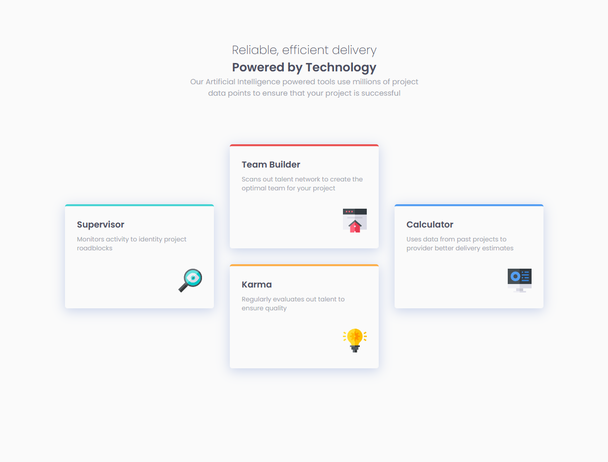

# Frontend Mentor - Four card feature section solution

This is a solution to the [Four card feature section challenge on Frontend Mentor](https://www.frontendmentor.io/challenges/four-card-feature-section-weK1eFYK). Frontend Mentor challenges help you improve your coding skills by building realistic projects.

## Table of contents

- [Overview](#overview)
  - [The challenge](#the-challenge)
  - [Screenshot](#screenshot)
  - [Links](#links)
- [My process](#my-process)
  - [Built with](#built-with)
  - [Useful resources](#useful-resources)
- [Author](#author)
- [Acknowledgments](#acknowledgments)

## Overview

### The challenge

Users should be able to:

- View the optimal layout for the site depending on their device's screen size

### Screenshot

### Links

- Solution URL: [Multi-step form from "Frontend Mentor" solution](https://www.frontendmentor.io/profile/markpiscis21)
- Live Site URL: [Multi-step form from "GitHub" page](https://markanthonyjc.github.io/four-card-feature-section-master)

## My process

### Built with

- [React](https://reactjs.org/) - JS library
- [SASS](https://sass-lang.com/) - Syntactically Awesome Style Sheets

### Useful resources

- [Vite](https://vitejs.dev) - A build tool that aims to provide a faster, more agile development experience for modern web projects.
- [BEM Convention](https://getbem.com) - This help me for to name selectors a way semantic.
- [NPM](https://www.npmjs.com) - A tool that allows me package or dependencies management in my project.

## Author

- LinkedIn - [Mark Anthony JC](https://www.linkedin.com/in/mark-anthony-jorge-cerr%C3%B3n-b3202b156/)
- Frontend Mentor - [@markanthony](https://www.frontendmentor.io/profile/markpiscis21)

## Acknowledgments

Grateful to [Fontend Mentor](https://www.frontendmentor.io) for the opportunity to provide learning content for thousands of people, helping us improve our web application development skills.
